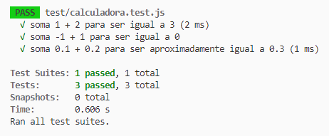
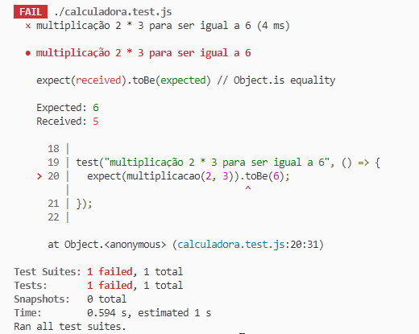

# Testes Unitários JS com JEST

  
  
Este repositório contém testes Jest para uma calculadora simples implementada em JavaScript. O módulo da calculadora está localizado no arquivo `src/calculadora.js`. O objetivo principal desses testes é garantir a correção da função `somar` dentro do módulo da calculadora

## Casos de Teste

1. **Teste para Adição**

   - Arquivo: `calculadora.test.js`
   - Teste: "soma 1 + 2 para ser igual a 3"
   - Código: `expect(somar(1, 2)).toBe(3);`
   - Descrição: Verifica se a soma de 1 e 2 é igual a 3.

2. **Teste para Adição com Números Negativos**

   - Arquivo: `calculadora.test.js`
   - Teste: "soma -1 + 1 para ser igual a 0"
   - Código: `expect(somar(-1, 1)).toBe(0);`
   - Descrição: Testa a adição de -1 e 1 para garantir que seja igual a 0.

3. **Teste para Adição com Números de Ponto Flutuante**
   - Arquivo: `calculadora.test.js`
   - Teste: "soma 0.1 + 0.2 para ser aproximadamente igual a 0.3"
   - Código: `expect(somar(0.1, 0.2)).toBeCloseTo(0.3);`
   - Descrição: Verifica se a soma de 0.1 e 0.2 é aproximadamente igual a 0.3.

### Tratando Erros

#### Caso de Acerto:

  

#### Caso de Erro:

  

## Notas

- Certifique-se de executar os testes usando o Jest para garantir o comportamento correto da função `somar`.

Sinta-se à vontade para expandir este README conforme necessário e adicionar mais casos de teste para garantir uma cobertura abrangente do módulo da calculadora. Boa codificação!
